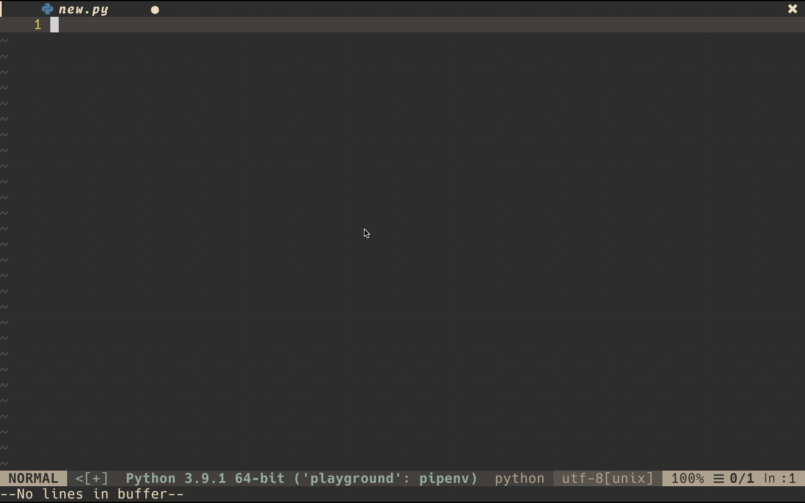

# My Neovim config

## Microsoft Python Language Server

Demo of [Microsoft Python Language Server](https://github.com/microsoft/python-language-server) using [coc.nvim](https://github.com/neoclide/coc.nvim) and [coc-python](https://github.com/neoclide/coc-python), with [pipenv](http://pipenv.pypa.io) support

## TODO

- Better Documentation
